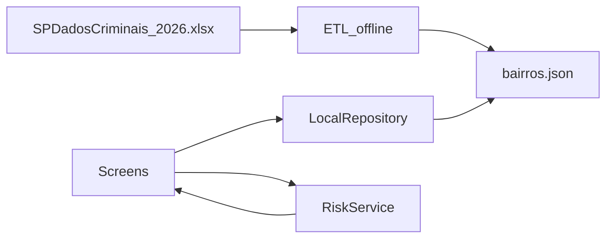

# Arquitetura Flutter (proposta) — Urban Safety

Documento de **planejamento**. O app ainda não está implementado neste repositório.

## Camadas previstas

```
screens/     → UI (Busca, Mapa/Detalhe, Dados gerais)
services/    → Regras (RiskService — RN04)
data/        → LocalRepository (lê JSON agregado)
models/      → Entidades tipadas
assets/data/ → Recorte adaptado da SSP (não o XLSX)
```

## Fluxo de dados



O XLSX fica fora do bundle do app. Só o JSON/SQL agregado entra no Flutter.

## Telas previstas

| Tela | Arquivo sugerido | Responsabilidade |
|------|------------------|------------------|
| Busca | `search_screen.dart` | Campo + lista filtrada |
| Mapa / Detalhe | `map_detail_screen.dart` | `flutter_map` + indicadores + vizinhos |
| Dados gerais | `city_overview_screen.dart` | Totais e ranking |

Navegação sugerida: `BottomNavigationBar` com Busca e Dados gerais; o detalhe abre via `Navigator.push` a partir da busca.

## Dependências previstas
- `flutter_map` + `latlong2` — mapa OpenStreetMap (sem chave paga)
- Sem state management externo no início (`setState`)

## Evoluções futuras (fora do escopo atual)
- Trocar JSON por SQLite (`sqflite`) usando o schema em `database/`
- Reexecutar o ETL quando houver novo XLSX da SSP
- Autenticação e favoritos
