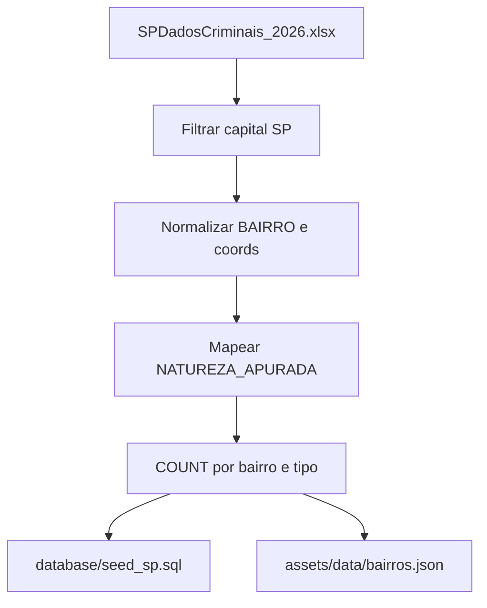
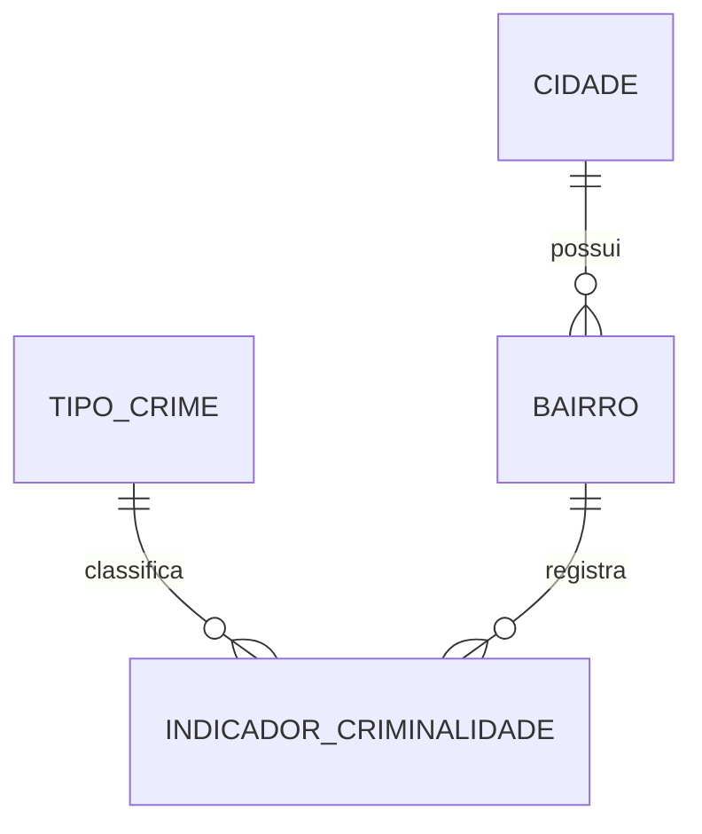
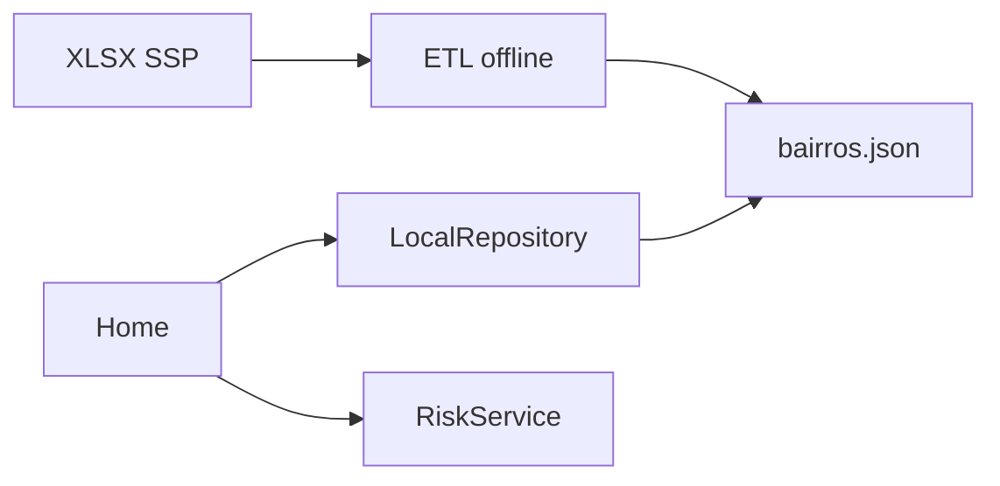

# Dados e arquitetura — SafePlace

O app **não** lê o XLSX. A planilha da SSP é filtrada, limpa e agregada para SQL (`database/`) e JSON (`safeplace/assets/data/bairros.json`).

## Fonte bruta

| Item | Valor |
|------|--------|
| Arquivo | `SPDadosCriminais_2026.xlsx` |
| Órgão | SSP/SP |
| Aba | `JAN-JUN_2026` |
| Período | jan–jun/2026 |
| Recorte do app | capital (`COD IBGE = 3550308` / `S.PAULO`) |

### Colunas usadas

| Coluna SSP | Uso |
|------------|-----|
| `COD IBGE` / `NOME_MUNICIPIO` | Filtrar capital → `cidade` |
| `BAIRRO` | Nome normalizado → `bairro` |
| `LATITUDE` / `LONGITUDE` | Centro do bairro (média das coords válidas) |
| `NATUREZA_APURADA` | furto / roubo / homicídio |
| `MES_ESTATISTICA` / `ANO_ESTATISTICA` | `periodo_inicio` / `periodo_fim` |

Não há coluna `quantidade`: cada linha conta 1.

### Pipeline



Normalizar bairro (unificar `SE`/`Sé`, `PINHEIROS`/`Pinheiros`); descartar vazio. Coords: só numéricos válidos (não `0` / `-`); se o bairro não tiver nenhuma, ponto de referência (GeoSampa).

| Código | Critério em `NATUREZA_APURADA` |
|--------|--------------------------------|
| `furto` | contém `FURTO` |
| `roubo` | contém `ROUBO` ou `LATROCÍNIO` |
| `homicidio` | contém `HOMICÍDIO DOLOSO` |

Demais naturezas ficam fora do MVP.

## Modelo do app



| Tabela | Origem |
|--------|--------|
| `cidade` | São Paulo / `3550308` |
| `bairro` | `BAIRRO` + lat/lng médios |
| `tipo_crime` | furto, roubo, homicidio |
| `indicador_criminalidade` | `COUNT` por bairro × tipo × período |

DDL e seed: [`database/schema.sql`](../database/schema.sql), [`database/seed_sp.sql`](../database/seed_sp.sql).

JSON no Flutter (denormalizado):

```json
{
  "cidade": { "id": 1, "nome": "São Paulo", "uf": "SP", "cod_ibge": 3550308 },
  "bairros": [
    {
      "id": 1,
      "nome": "Pinheiros",
      "latitude": -23.5615,
      "longitude": -46.6917,
      "indicadores": { "furtos": 0, "roubos": 0, "homicidios": 0 }
    }
  ]
}
```

## Arquitetura Flutter

```
safeplace/lib/
  screens/    Home: busca + mapa
  widgets/    Logo e wordmark
  theme/      Paleta e tipografia
  services/   RiskService (RN04)
  data/       LocalRepository (JSON)
  models/     Bairro
```



Dependências: `flutter_map` + `latlong2` (OSM/Carto, sem chave). Estado inicial: `setState`.

**Telas:** home (busca + mapa, implementada) e dados gerais da cidade (MVP). Sem SQLite, auth ou favoritos nesta versão.

## Limitações

Agregação acadêmica — não substitui a estatística oficial (Resolução SSP 160/01). Nomes de bairro na SSP são texto livre; ~15% das linhas da capital podem ter lat/lng inválidos. A base atual cobre só o 1º semestre de 2026.

*Fonte dos microdados: SSP/SP — SPDadosCriminais 2026. Indicadores agregados pelo projeto para fins acadêmicos.*
