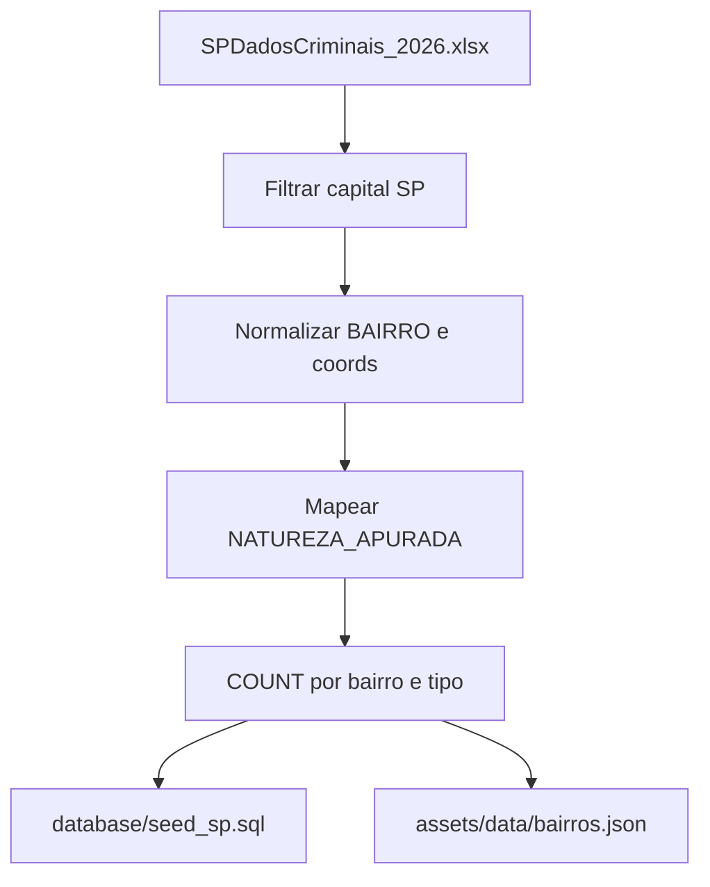
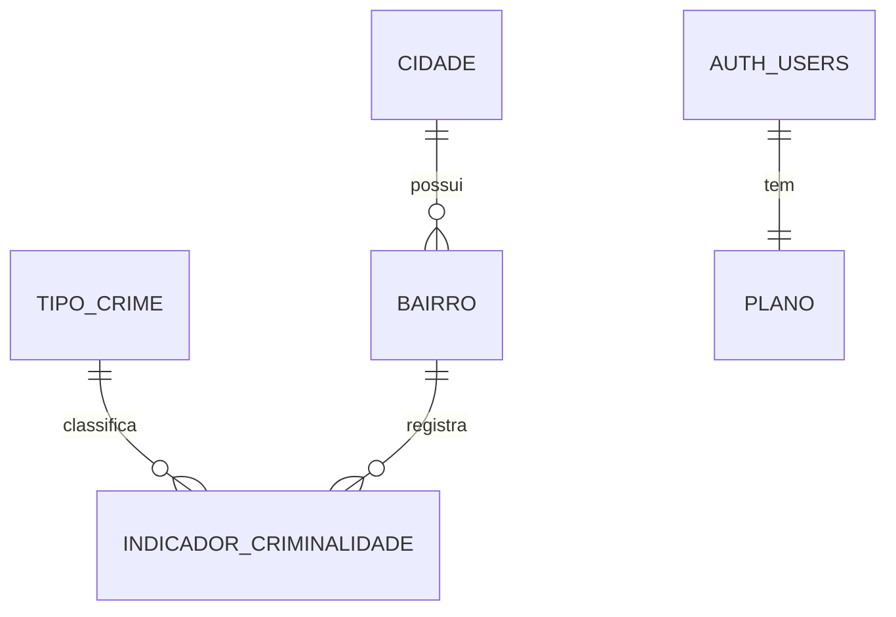
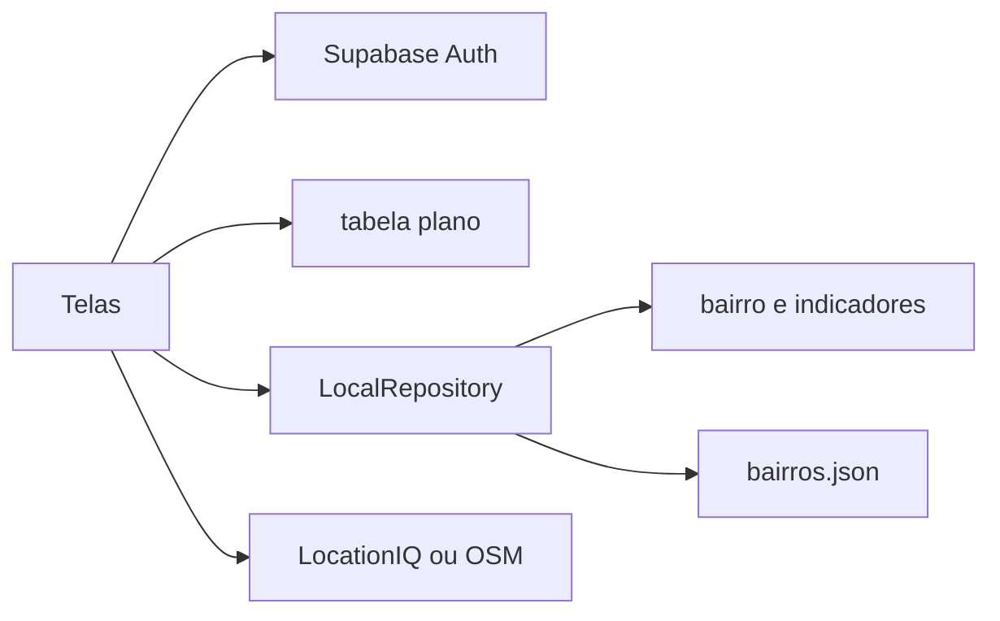

# Dados e arquitetura — SafePlace

O app **não** lê o XLSX. A planilha da SSP é filtrada, limpa e agregada para o Postgres (`database/`) e, como reserva, para o JSON (`safeplace/assets/data/bairros.json`).

## Fonte bruta

| Item | Valor |
| --- | --- |
| Arquivo | `SPDadosCriminais_2026.xlsx` (SSP/SP, fora do repositório) |
| Aba | `JAN-JUN_2026` |
| Período | jan–jun/2026 |
| Recorte do app | capital (`COD IBGE = 3550308` / `S.PAULO`) |

### Colunas usadas

| Coluna SSP | Uso |
| --- | --- |
| `COD IBGE` / `NOME_MUNICIPIO` | Filtrar capital → `cidade` |
| `BAIRRO` | Nome normalizado → `bairro` |
| `LATITUDE` / `LONGITUDE` | Centro do bairro |
| `NATUREZA_APURADA` | furto / roubo / homicídio |
| `MES_ESTATISTICA` / `ANO_ESTATISTICA` | `periodo_inicio` / `periodo_fim` |

Não há coluna `quantidade`: cada linha conta 1.

### Pipeline



Normalizar bairro (unificar `SE`/`Sé`, `PINHEIROS`/`Pinheiros`); descartar vazio. Coords: só numéricos válidos (não `0` / `-`); se o bairro não tiver nenhuma, ponto de referência (GeoSampa).

| Código | Critério em `NATUREZA_APURADA` |
| --- | --- |
| `furto` | contém `FURTO` |
| `roubo` | contém `ROUBO` ou `LATROCÍNIO` |
| `homicidio` | contém `HOMICÍDIO DOLOSO` |

Demais naturezas ficam de fora. Os valores atuais do seed e do JSON são placeholder.

## Modelo



| Tabela | Origem |
| --- | --- |
| `cidade` | São Paulo / `3550308` |
| `bairro` | `BAIRRO` + lat/lng |
| `tipo_crime` | furto, roubo, homicidio |
| `indicador_criminalidade` | `COUNT` por bairro × tipo × período |
| `plano` | `eh_pro` e o relatório grátis da conta |
| `auth.users` | e-mail, senha e nome (metadado), no Supabase Auth |

DDL e seed: [`database/schema.sql`](../database/schema.sql), [`database/seed_sp.sql`](../database/seed_sp.sql). O `id` é `GENERATED ALWAYS`; o seed usa `OVERRIDING SYSTEM VALUE`.

O JSON de reserva repete o bairro já com os três totais:

```json
{
  "nome": "Pinheiros",
  "latitude": -23.5615,
  "longitude": -46.6917,
  "indicadores": { "furtos": 40, "roubos": 12, "homicidios": 0 }
}
```

## Arquitetura Flutter

```
safeplace/lib/
  screens/    entrada, login, cadastro, home, planos, relatório
  widgets/    logo, anúncio, risco, tendência, campo de auth
  services/   auth, plano, risco, relatório, contorno
  data/       bairros (Supabase, com reserva no JSON) e anúncios
  config/     URL e chave anon do Supabase; token da LocationIQ
  models/     Bairro, Usuario, Anuncio
```



Logado, `LocalRepository` lê `bairro` com `indicador_criminalidade` e `tipo_crime`. Lista vazia ou erro: usa o JSON. Os testes não iniciam o Supabase e seguem pela conta local.

Mapa: `flutter_map`. Gráficos: `fl_chart`. Conta e banco: `supabase_flutter`.

## Limitações

Agregação acadêmica — não substitui a estatística oficial (Resolução SSP 160/01). A série mensal do relatório reparte o total do semestre; não é o mês publicado pela SSP. Nomes de bairro na SSP são texto livre. A base cobre o 1º semestre de 2026.

*Fonte dos microdados: SSP/SP — SPDadosCriminais 2026. Indicadores agregados pelo projeto para fins acadêmicos.*
