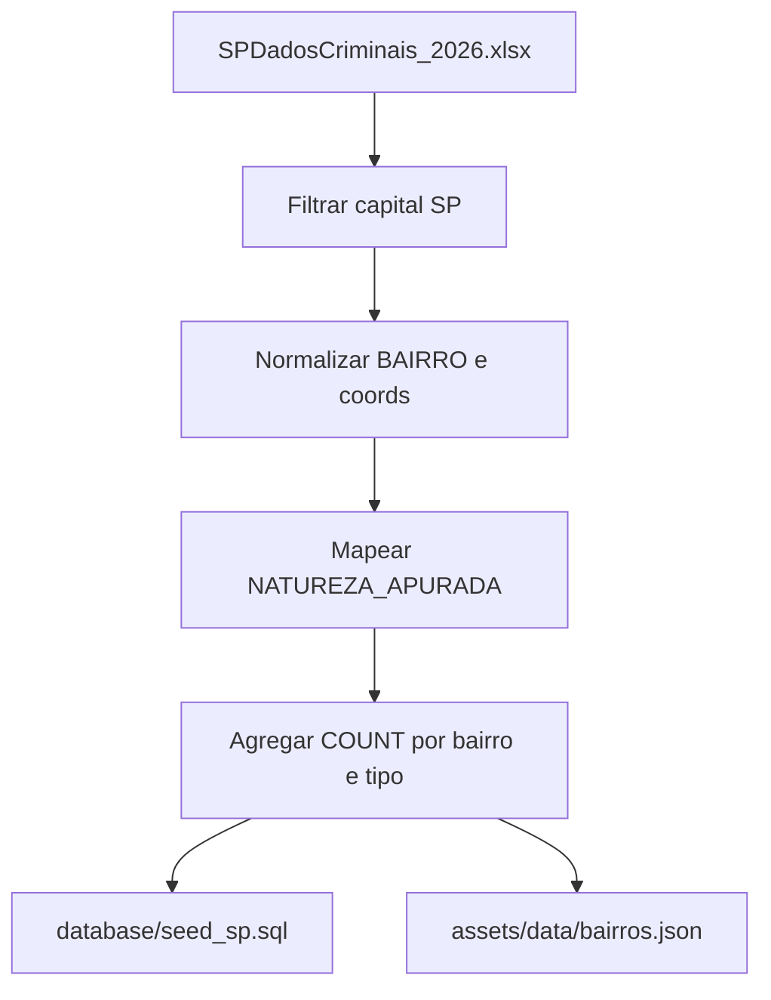

# Fonte de Dados — Adaptação SSP → modelo do app

## Fonte oficial (bruta)

| Item | Valor |
|------|--------|
| Arquivo | [`SPDadosCriminais_2026.xlsx`](../SPDadosCriminais_2026.xlsx) |
| Órgão | Secretaria da Segurança Pública do Estado de São Paulo (SSP/SP) |
| Aba de dados | `JAN-JUN_2026` |
| Aba de metadados | `Campos da Tabela_SPDADOS` |
| Período coberto | Janeiro a junho de 2026 (`MES_ESTATISTICA` 1–6, `ANO_ESTATISTICA` 2026) |
| Escopo no estado | ~555 mil ocorrências |
| Escopo no app | apenas capital **São Paulo** (`NOME_MUNICIPIO = S.PAULO` ou `COD IBGE = 3550308`) ≈ 224 mil linhas |

O app **não** consome o XLSX diretamente. Os dados são filtrados, limpos e agregados para o schema próprio em `database/` e, no Flutter, para `assets/data/bairros.json`.

---

## Colunas da SSP usadas

| Coluna SSP | Uso no projeto |
|------------|----------------|
| `COD IBGE` / `NOME_MUNICIPIO` | Filtrar capital (`3550308` / `S.PAULO`) → tabela `cidade` |
| `BAIRRO` | Nome do bairro (após normalização) → tabela `bairro` |
| `LATITUDE` / `LONGITUDE` | Centro aproximado do bairro (média das coords válidas) |
| `NATUREZA_APURADA` | Classificar em furto / roubo / homicídio → `tipo_crime` |
| `MES_ESTATISTICA` / `ANO_ESTATISTICA` | Definir `periodo_inicio` e `periodo_fim` |
| `DATA_OCORRENCIA_BO` | Apoio temporal (opcional) |

Colunas úteis mas não obrigatórias no MVP: `LOGRADOURO`, `RUBRICA`, `NOME_DELEGACIA`, `NOME_*_CIRCUNSCRICAO`.

Não existe coluna `quantidade` na base bruta: **cada linha conta como 1 ocorrência** na agregação.

---

## Pipeline de adaptação



### 1. Filtro geográfico
Manter apenas linhas da capital:
- `COD IBGE == 3550308`, ou
- `NOME_MUNICIPIO == "S.PAULO"`

### 2. Limpeza de bairro
- Trim, uppercase/title-case consistente
- Unificar variantes (`SE` / `Sé` / `sé` → `Sé`; `PINHEIROS` / `Pinheiros` → `Pinheiros`)
- Descartar bairros vazios ou inválidos

### 3. Coordenadas
- Aceitar apenas lat/lng numéricos válidos (excluir `0`, `-`, nulos)
- Por bairro: **média** das coordenadas válidas → `bairro.latitude` / `bairro.longitude`
- Se o bairro não tiver nenhuma coord válida, usar ponto de referência fixo (lista manual ou GeoSampa)

### 4. Mapeamento de natureza → `tipo_crime`

| Código do app | Critério em `NATUREZA_APURADA` (exemplos) |
|---------------|-------------------------------------------|
| `furto` | contém `FURTO` (ex.: `FURTO - OUTROS`, `FURTO DE VEÍCULO`) |
| `roubo` | contém `ROUBO` ou `LATROCÍNIO` |
| `homicidio` | contém `HOMICÍDIO DOLOSO` (MVP: só doloso; excluir culposo/trânsito se desejado) |

Demais naturezas (lesão, tráfico, estupro etc.) ficam **fora** dos três indicadores do MVP, mas podem alimentar evoluções futuras.

### 5. Agregação
Para cada bairro e cada `tipo_crime`:

```
quantidade = COUNT(*) das linhas filtradas no período
periodo_inicio = 2026-01-01
periodo_fim    = 2026-06-30
```

Resultado alimenta `indicador_criminalidade` e o JSON denormalizado do app.

---

## Modelo próprio (destino)

Ver [modelo-de-dados.md](modelo-de-dados.md). Resumo:

| Tabela do app | Origem adaptada |
|---------------|-----------------|
| `cidade` | 1 registro: São Paulo / SP |
| `bairro` | `BAIRRO` normalizado + lat/lng médios |
| `tipo_crime` | catálogo fixo: furto, roubo, homicidio |
| `indicador_criminalidade` | `COUNT` por bairro × tipo × período |

---

## Limitações e avisos

1. Tratamento acadêmico: agregação simplificada; **não** substitui a estatística oficial da SSP (Resolução SSP 160/01).
2. Nomes de bairro na SSP são texto livre (~2,5 mil variantes brutas) — a normalização é parte do ETL.
3. ~15% das linhas da capital podem ter lat/lng inválidos.
4. Este arquivo cobre só o 1º semestre de 2026.
5. O XLSX (~90 MB) permanece na raiz como **fonte bruta**; o app usa apenas o recorte agregado.

**Citação sugerida no app:** *Fonte dos microdados: SSP/SP — SPDadosCriminais 2026. Indicadores agregados pelo projeto para fins acadêmicos.*
