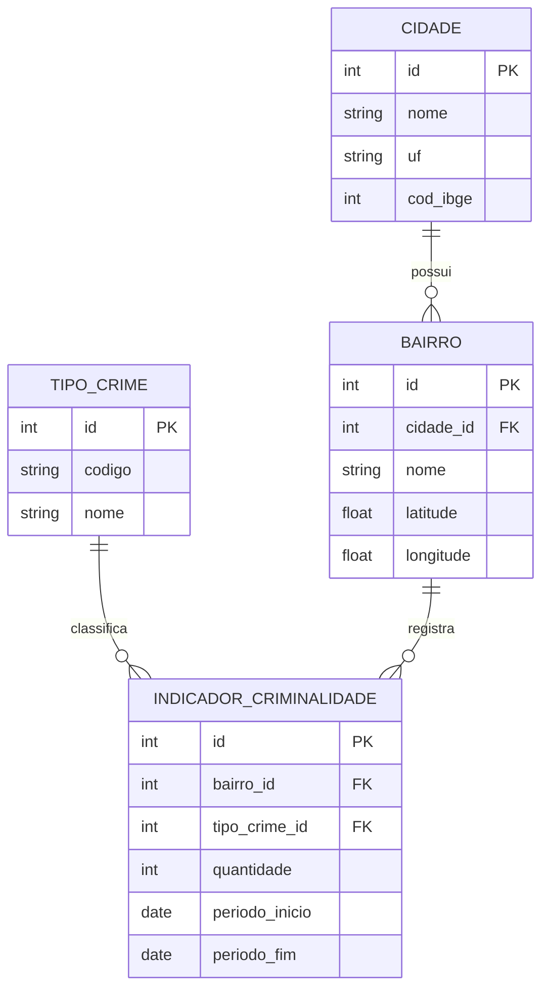

# Modelo de Dados — App de Segurança Urbana

Modelo **próprio** do aplicativo. Os dados vêm da base SSP [`SPDadosCriminais_2026.xlsx`](../SPDadosCriminais_2026.xlsx) após o ETL descrito em [fonte-de-dados.md](fonte-de-dados.md).

## Visão geral



## Origem SSP → tabelas do app

| Entidade do app | Origem na planilha SSP |
|-----------------|------------------------|
| `cidade` | `NOME_MUNICIPIO` / `COD IBGE` (fixo: São Paulo, 3550308) |
| `bairro.nome` | `BAIRRO` normalizado |
| `bairro.lat/lng` | média de `LATITUDE` / `LONGITUDE` válidas |
| `tipo_crime` | agrupamento de `NATUREZA_APURADA` |
| `indicador_criminalidade.quantidade` | `COUNT(*)` das linhas no período |

## Tabelas

### `cidade`
| Coluna | Tipo | Descrição |
|--------|------|-----------|
| id | INTEGER PK | Identificador |
| nome | TEXT | Nome da cidade (`São Paulo`) |
| uf | TEXT | `SP` |
| cod_ibge | INTEGER | Código IBGE (`3550308`), alinhado à coluna `COD IBGE` da SSP |

### `bairro`
| Coluna | Tipo | Descrição |
|--------|------|-----------|
| id | INTEGER PK | Identificador |
| cidade_id | INTEGER FK | Referência a `cidade` |
| nome | TEXT | Nome normalizado do bairro |
| latitude | REAL | Centro aproximado (média das ocorrências) |
| longitude | REAL | Centro aproximado (média das ocorrências) |

### `tipo_crime`
| Coluna | Tipo | Descrição |
|--------|------|-----------|
| id | INTEGER PK | Identificador |
| codigo | TEXT UNIQUE | `furto`, `roubo`, `homicidio` |
| nome | TEXT | Nome legível |

### `indicador_criminalidade`
| Coluna | Tipo | Descrição |
|--------|------|-----------|
| id | INTEGER PK | Identificador |
| bairro_id | INTEGER FK | Referência a `bairro` |
| tipo_crime_id | INTEGER FK | Referência a `tipo_crime` |
| quantidade | INTEGER | Contagem agregada no período (derivada da SSP) |
| periodo_inicio | TEXT (DATE) | Início (ex.: `2026-01-01`) |
| periodo_fim | TEXT (DATE) | Fim (ex.: `2026-06-30`) |

## Espelhamento previsto no Flutter
O app consome o **recorte agregado**, não o XLSX. Estrutura sugerida em `assets/data/bairros.json`:

```json
{
  "fonte": {
    "orgao": "SSP/SP",
    "arquivo": "SPDadosCriminais_2026.xlsx",
    "periodo": { "inicio": "2026-01-01", "fim": "2026-06-30" },
    "aviso": "Agregação acadêmica; não substitui estatística oficial."
  },
  "cidade": { "id": 1, "nome": "São Paulo", "uf": "SP", "cod_ibge": 3550308 },
  "bairros": [
    {
      "id": 1,
      "nome": "Pinheiros",
      "latitude": -23.5615,
      "longitude": -46.6917,
      "indicadores": { "furtos": 0, "roubos": 0, "homicidios": 0 }
    }
  ]
}
```

Os valores de `indicadores` devem ser preenchidos pelo ETL a partir da planilha.

Scripts SQL: [`database/schema.sql`](../database/schema.sql) e [`database/seed_sp.sql`](../database/seed_sp.sql).
